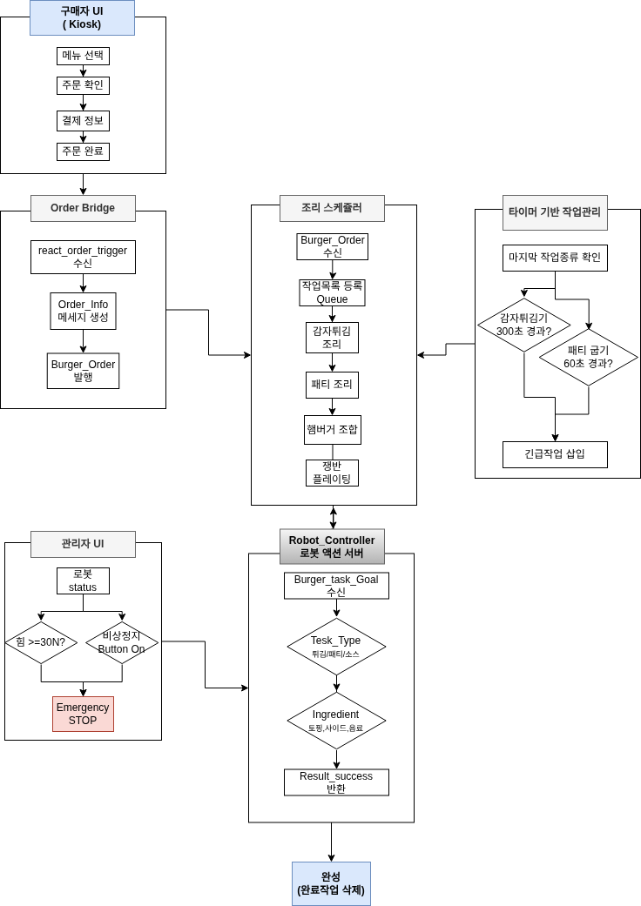

# [프로젝트 이름] 햄버거 조리-제작 자동화
> **조 이름:** [B-1 - ROKEY_B-1]
> **팀원:** [이준우, 김범준, 허재혁, 정준혁]

## 1. 🎨 시스템 설계 및 플로우 차트
프로젝트의 전체적인 구조와 소프트웨어 흐름도입니다.

### 1-1. 시스템 설계도 (System Architecture)
- React(사용자용 키오스크 / 관리자용 HMI)는 ROS2와 ROSBRIDGE 패키지로 연결됩니다.
- ROS2 노드들은 두산 로봇 M0609와 두산 로봇 API, 이더넷으로 연결됩니다.
- **사용자 키오스크 웹페이지** (App.jsx)
  - React 기반 UI
  - 사용자가 햄버거를 커스텀으로 주문할 수 있는 페이지입니다.
  - 토픽 전송:
    - `react_order_trigger`(std/msgs/String): ui_node에 사용자가 선택한 주문 재료 목록을 전송합니다.
- **관리자 HMI 웹페이지** (AdminApp.jsx)
  - React 기반 UI
  - 관리자가 로봇의 상태와 긴급정지를 할 수 있는 페이지입니다.
  - 토픽 전송
    - `/emergency_stop`(std/msgs/Bool) : 비상정지 버튼을 누르면 True 아니면 False를 safety_manager_node에 전송합니다.
  - 토픽 수신:
    - `/robot_telemetry_topic`(std/msgs/String): robot_controller_node로부터 외력/현재 작업/작업 도구/그리퍼 상태/작업 재료의 정보를 수신 받아 페이지에 출력합니다.
    - `/robot_status_topic`(std/msgs/String): safety_manager_node로부터 비상정지 상황인지를 이유와 함께 수신받습니다.
- **ui_node** 
  - 토픽 수신:
    - `react_order_trigger`(std/msgs/String): 키오스크로부터 사용자가 선택한 주문 재료 목록을 수신 받습니다.
  - 토픽 전송:
    - `burger_order`(hamburger_interfaces/msg/OrderInfo): 키오스크에서 받아온 주문 재료 목록을 전체 재료들과 비교하여 있으면 True, 없으면 False를 cooking_manager_node에 전송합니다. 
- **cooking_manager_node** 
  - 전송 받은 재료 목록들의 작업 순서들을 Queue에 삽입해두고 한 작업씩 Pop하여 robot_controller_node에 전송합니다. 
  - robot_controller_node에서 작업 완료 신호를 받으면 다음 작업을 Queue에서 Pop하여 cooking_manager_node에 전송을 반복합니다.
  - 튀김 꺼내기, 패티 뒤집기/옮기기, 등의 작업은 일정 시간의 타이머가 지나면 Queue 맨 앞으로 삽입하여 바로 작업을 수행할 수 있도록 구현하였습니다.
  - 토픽 수신:
    - `burger_order`(hamburger_interfaces/msg/OrderInfo): 재료 여부를 True, 없으면 False를 수신받습니다. 
  - 제공 액션:
    - `/burger_task`(hamburger_interfaces/action/BurgerTask) 액션 클라이언트: 작업 1개를 robot_cotroller_node에 액션 Goal로 전송 / 액션 Result로 success = True를 받으면 다음 작업을 액션 Goal 전송하여 반복
- **robot_controller_node** 
  - 전송 받은 작업에 대해 로봇이 실제로 동작을 수행합니다.
  - 실시간으로 외력 데이터를 받아 계산하고 일정 기준값이 넘으면 True를 safety_manager_node에 전송합니다.
  - 제공 액션:
    - `/burger_task`(hamburger_interfaces/action/BurgerTask) 액션 서버: 작업 1개를 robot_cotroller_node에 액션 Goal로 전송 / 액션 Result로 success = True를 받으면 다음 작업을 액션 Goal 전송하여 반복
  - 토픽 전송:
    - `/robot_force_sensor`(std/msgs/Bool) : 외력값을 기준값에 따라 True/False로 safety_manager_node에 전송
    - `/robot_telemetry_topic`(std/msgs/String) : 관리자 HMI 웹페이지에 외력/현재 작업/작업 도구/그리퍼 상태/작업 재료의 정보를 전송합니다.
  - 제공 서비스
    - `/emergency_stop_robot_controller`(hamburger_interfaces/srv/EmergencyStop) 서비스 서버 : 비상정지 상황 여부와, 이유를 safety_manager_node로부터 서비스 요청받아 로봇의 동작을 긴급정지 시킵니다.
- **safety_manager_node** 
  - 관리자 HMI로 비상정지 버튼이 눌리거나 로봇에 외력이 가해지면 비상정지 상황임을 robot_controller_node, 관리자 HMI에 알립니다.
  - 토픽 전송:
    - `/robot_status_topic`(std/msgs/String): 관리자 HMI에 비상정지 상황을 이유와 함께 전송합니다.
  - 토픽 수신:
    - `/robot_force_sensor`(std/msgs/Bool) : robot_controller_node로부터 외력이 기준값을 넘었는지 True/False로 수신 받습니다.
    - `/emergency_stop`(std/msgs/Bool) : 관리자 HMI로부터 비상정지 버튼이 눌렸는지에 대한 True/False를 수신 받습니다.
  - 제공 서비스
    - `/emergency_stop_robot_controller`(hamburger_interfaces/srv/EmergencyStop) 서비스 클라이언트 : 비상상황이 되면 True와 그에 대한 이유(관리자 버튼/외력)를 전송하면서 robot_controller_node에 비상정지 서비스를 요청합니다.


### 1-2. 플로우 차트 (Flow Chart)
<p align="center">
  
</p>
---

## 2. 🖥️ 운영체제 환경 (OS Environment)
이 프로젝트는 다음 환경에서 개발하였습니다.

* **OS:** Ubuntu 22.04 LTS
* **ROS Version:** ROS2 Humble
* **Language:** Python 3.8 
* **IDE:** VS Code

---

## 3. 🛠️ 사용 장비 목록 (Hardware List)
프로젝트에 사용된 주요 하드웨어 장비입니다.

| 장비명 (Model) | 수량 | 비고 |
|:---:|:---:|:---|
| [두산 로봇팔 M0609] | 1 | [ ] |
| [RG2 Gripper] | 1 | [ ] |

---

## 4. 📦 의존성 (Dependencies)
프로젝트 실행에 필요한 라이브러리입니다.

* Python >= 3.8
* npm 10.8.2
* node 20.20.2
* rosbridge_suite 2.0.6
* tf2-web-republisher 1.0.0
* rclpy
* hamburger_interfaces
* dsr_description2
* m0609_rg2_bringup
* onrobot_rg_description

---

## 5. ▶️ 실행 순서 (Usage Guide)
프로젝트를 실행하기 위한 순서입니다. 터미널 명령어를 순서대로 입력해 주세요.
### Step 1. [깃허브에서 클론] 깃허브에서 프로젝트를 클론해옵니다.
```bash
git clone https://github.com/2028jun/DoosanRokey_B_1.git
```
### Step 2. [파일 링크 설정] burger_kiosk/public에서 링크 파일을 생성합니다. (기존에 있던 파일은 지우고 자신의 컴퓨터 환경에 맞게 생성 )
### ※ 파일 경로가 자신의 컴퓨터와 맞는지 잘 확인하세요
```bash
cd ~/DoosanRokey_B_1/burger_kiosk/public

rm -rf ros_models
mkdir -p ros_models

ln -s /home/<사용자명>/ws_cobot1_pjt/ws_edu/src/doosan-robot2/dsr_description2 ros_models/dsr_description2
ln -s /home/<사용자명>/ws_cobot1_pjt/ws_edu/src/rg2/m0609_rg2_bringup ros_models/m0609_rg2_bringup
ln -s /home/<사용자명>/ws_cobot1_pjt/ws_edu/src/onrobot-ros2/onrobot_rg_description ros_models/onrobot_rg_description
```
### Step 3. [패키지 빌드] 패키지를 빌드합니다.
```bash
cd ~/DoosanRokey_B_1/burger_ws

colcon build --symlink-install
source install/setup.bash
```
### Step 4. [로봇 초기화] 로봇의 전원을 켜고 통신을 연결합니다.
```bash
ros2 launch m0609_rg2_bringup bringup.launch.py model:=m0609, mode:=real host:=192.168.1.100
```
### Step 5. [프론트엔드 실행] 사용자 주문용 키오스크 페이지와 관리자용 HMI 페이지를 실행합니다.
### burger_kiosk 위치에서 실행하며 Local 주소를 ctrl + 클릭으로 주문용 키오스크를 실행한 후 새 창에 주소 뒤 /admin을 붙여 관리자용 HMI 페이지를 실행합니다. 
```bash
cd ~/DoosanRokey_B_1/burger_kiosk
npm run dev
```
### Step 6. [React와 Ros2 통신 연결] React와 Ros2의 통신을 연결합니다.
```bash
cd ~/DoosanRokey_B_1/burger_ws
source install/setup.bash

ros2 launch rosbridge_server rosbridge_websocket_launch.xml 

```
### Step 7. [로봇의 관절 데이터와 React 통신 연결] 로봇의 관절 데이터와 React 통신을 연결하여 프론트엔드에서 로봇 움직임을 실시간으로 확인할 수 있도록 합니다.
```bash
cd ~/DoosanRokey_B_1/burger_ws
source install/setup.bash

ros2 run tf2_web_republisher tf2_web_republisher_node
```
### Step 8 [메인 제어 런치 파일 실행] 메인 제어 런치 파일을 실행합니다.
```bash
cd ~/DoosanRokey_B_1/burger_ws
source install/setup.bash

ros2 launch auto_make_hamburger burger.launch.py 
```
### Step 6 [주문 실행] 주문용 키오스크 페이지에서 원하는 재료를 클릭하고 주문하기 -> 결제하기를 누르면 로봇이 동작합니다.
</p>
